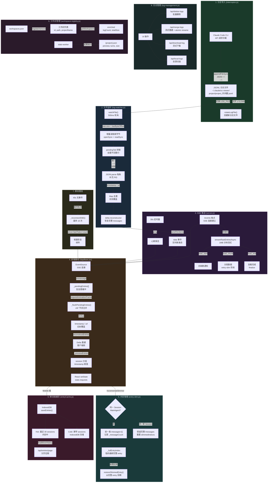

# JSONL Log Lifecycle Management

> cc-viewer JSONL 日志完整生命周期流程图

## 关键数据流

| 阶段 | 模块 | 核心机制 |
|------|------|---------|
| **写入** | `interceptor.js` | appendFileSync + 512MB 轮转 |
| **监听** | `log-watcher.js` | watchFile 500ms + lastByteOffset 增量读取 |
| **解析** | `delta-reconstructor.js` | checkpoint + delta 重建完整 messages |
| **推送** | `server.js` /events | SSE load_start → load_chunk → load_end → data |
| **接收** | `AppBase.jsx` | EventSource + rAF 批处理 + dedup |
| **剪枝** | `entry-slim.js` | 同 session 只保留最新 MainAgent 完整 messages |
| **缓存** | `entryCache.js` | Mobile IndexedDB hot/cold 分层 |
| **重连** | `AppBase.jsx` | 45s 超时 → 最多 10 次 → since 参数续传 |
| **管理** | `log-management.js` | 列表 / 删除 / 合并 / 下载 |
| **工作区** | `workspace-registry.js` | workspaces.json + withLock 并发安全 |
